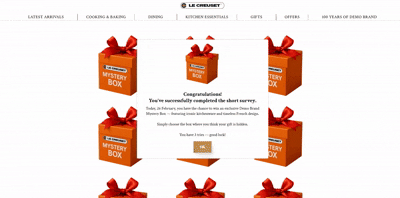

# Mystery Box Demo 🎁

## О проекте
**Mystery Box Demo** — это демонстрационный проект для портфолио, реализующий интерактивный пользовательский интерфейс с "тайным" выбором. Основная логика реализована на JavaScript, а PHP используется для вставки текстового контента на страницы.  

## Особенности
- Открытие коробок с красивой анимацией.
- клиентская логика на JavaScript.
- Легко интегрируемый и адаптируемый интерфейс.

## Технологии
- **JavaScript** — логика взаимодействия и генерация призов
- **HTML/CSS** — структура и стили
- **PHP**
- **SVG / WebP / GIF** — графика и анимации

## Локальный запуск с Open Server

1. Установите и запустите **Open Server Panel**.
2. Скопируйте папку проекта в корень сервера Open Server (`domains`).
   Например: `C:\OpenServer\domains\mystery-box-demo`.
3. В панели Open Server запустите сервер.
4. Откройте браузер и перейдите по адресу:
